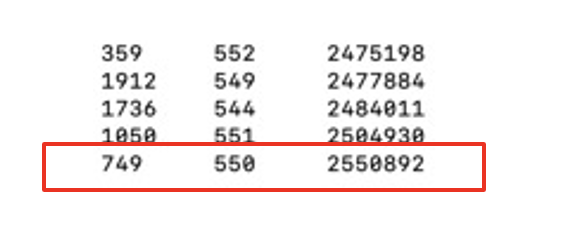
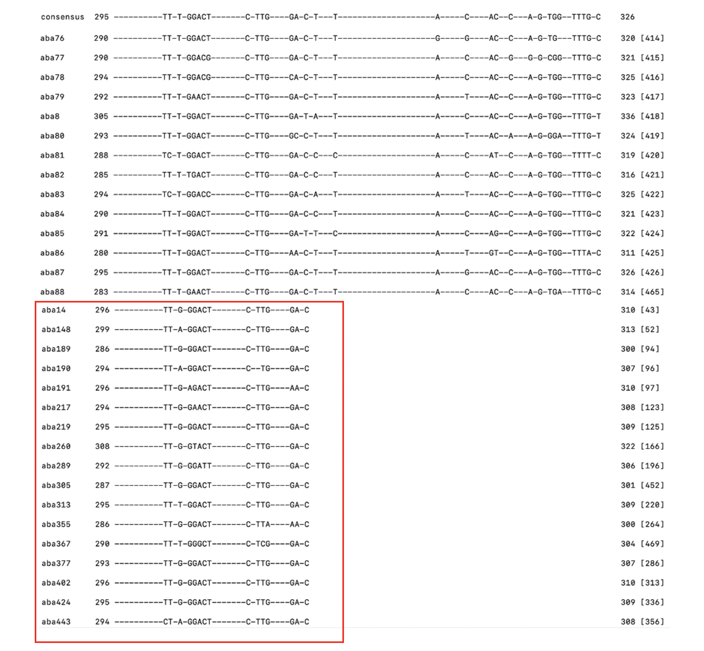

#Classification of subfamilies

We used [RepeatModeler][] to classify the subfamilies of the human genome. 
Take the extracted sequenced (e.g.aba.fa) and determining which is the best representative sequence to use as a starting consensus sequence. The first step is to perform a self-comparison using an aligner [rmblast][].

```sh
rmblast.pl aba.fa aba.fa masklevel 101 > scorenew
```
In order to determine which sequences scores the highest against all possible combinations:
```sh
bestscore.pl scorenew
```
below you can see seq749 is the best representative sequence.

then searched for the associated sequence in the aba.fa file and placed it in a file I named con.fa.
```sh
alignAndCallConsensus.pl -c con.fa -e aba.fa -ma 14 -int -html
```
-c: consensus sequence
-e: extracted sequence
-ma: match score
-int: output in html format

Then you will got some out files, and we need to find fixed pattern.
below is the result of the aba.ali

Also you can find more details about the result in aba.out:

* The sequences have similar divergence
* They all do not align to the last 245 bp of the consensus sequence

Separate them to construct a new subfamily.
Repeat procedures below until you feel like no subfamilies can be separated any more.


[RepeatModeler]: https://github.com/Dfam-consortium/RepeatModeler
[rmblast]: https://www.ncbi.nlm.nih.gov/books/NBK2762/

